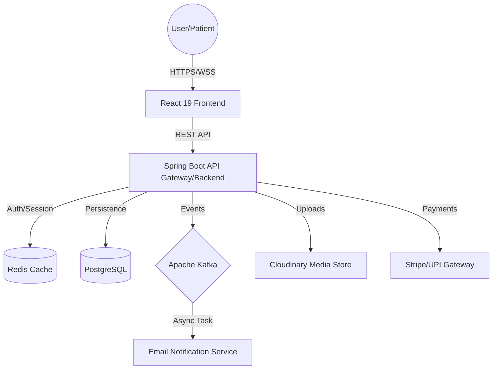

# 🏥 HMS: Enterprise Hospital Management System

[](https://www.oracle.com/java/)
[](https://spring.io/projects/spring-boot)
[](https://react.dev/)
[](https://www.postgresql.org/)
[](https://redis.io/)
[](https://kafka.apache.org/)

**HMS** is a production-grade, full-stack healthcare ecosystem designed to eliminate operational inefficiencies in hospitals. It implements a **Distributed System approach** using a decoupled Frontend and Backend, leveraging event-driven architecture for scalability and real-time responsiveness.

---

## 🗺️ System Architecture (HLD)

The system is designed as a **Client-Server Architecture** with an asynchronous event layer.

### 📐 High-Level Design (HLD)


### ⚙️ Architectural Pillars
1.  **Scalability**: Used **Redis** for distributed caching to reduce database load and **Kafka** to decouple heavy tasks (like emailing PDFs) from the main request-response cycle.
2.  **Reliability**: Implemented **Resilience4j** for rate limiting to prevent API abuse and **Flyway** for versioned database migrations.
3.  **Real-time Communication**: Integrated **WebSockets (STOMP/SockJS)** to enable instant routing alerts from Receptionists to Doctors.
4.  **Security**: A strict **RBAC (Role-Based Access Control)** model ensuring data isolation between Patients, Doctors, Receptionists, and Admins.

---

## 🛠️ Low-Level Design (LLD)

### 🖥️ Frontend Architecture (LLD)
The frontend is built with a **Modular Component-Based Architecture** to ensure reusability and maintainability.

**Core Layers:**
- **View Layer**: React 19 + Tailwind CSS 4. Utilizes **Three.js & GSAP** for an immersive, modern UX.
- **State Management**: 
    - **Server State**: **TanStack Query (React Query)** for caching API responses and handling optimistic updates.
    - **Client State**: React Context API for user sessions and theme management.
- **Networking**: Axios interceptors for centralized JWT handling and error logging.
- **Real-time Layer**: StompJS client for listening to doctor-routing events.

**Folder Structure Logic:**
- `/pages`: Route-level components.
- `/components`: Atomic UI elements (Buttons, Inputs, Modals).
- `/hooks`: Custom business logic extracted from UI (e.g., `useAppointment()`).
- `/services`: API call definitions.

### ⚙️ Backend Architecture (LLD)
The backend follows the **Layered Architecture (N-Tier)** pattern to separate concerns.

**Request Flow:**
`HTTP Request` $\rightarrow$ `Controller` $\rightarrow$ `Service Interface` $\rightarrow$ `Service Implementation` $\rightarrow$ `Repository` $\rightarrow$ `Database`

**Component Breakdown:**
- **Controllers**: Handle request mapping, input validation (`@Valid`), and DTO mapping.
- **Service Layer**: Contains the core business logic. Implements `@Transactional` to ensure ACID compliance.
- **Repository Layer**: Spring Data JPA for type-safe database queries.
- **Event Layer**: Kafka Producers publish `AppointmentEvent` when status changes, which are consumed by notification listeners.
- **Security Layer**: JWT-based stateless authentication. Custom `UserDetailsService` for multi-role verification.

---

## 💾 Data Design & Schema

The system uses a **Normalized Relational Schema** to ensure zero data redundancy.

### 🗝️ Key Entities & Relations
| Entity | Primary Key | Foreign Keys | Key Attributes |
| :--- | :--- | :--- | :--- |
| **User** | `user_id` | - | email, password, role, status |
| **Patient** | `patient_id` | `user_id` | medical_history, blood_group, insurance_id |
| **Doctor** | `doctor_id` | `user_id`, `branch_id` | specialization, consultation_fee, slots |
| **Branch** | `branch_id` | - | location, branch_name, contact |
| **Appointment** | `app_id` | `patient_id`, `doctor_id`, `branch_id` | date, time, status, reason |
| **Prescription** | `presc_id` | `app_id`, `doctor_id` | medicines (JSON), notes, date |
| **Payment** | `pay_id` | `app_id` | amount, transaction_id, method (Stripe/UPI) |

---

## 🔄 End-to-End Business Workflows

### 1. The Patient Journey (Booking $\rightarrow$ Payment)
1.  **Auth**: Patient signs up via **Magic Link/OAuth2** $\rightarrow$ JWT stored in HttpOnly Cookie.
2.  **Discovery**:
    *   **Path A**: Search by **Doctor Specialization** $\rightarrow$ View ratings $\rightarrow$ Select Doctor.
    *   **Path B**: Select **Hospital Branch** $\rightarrow$ Select Department $\rightarrow$ View available Doctors.
3.  **Scheduling**: Patient chooses an available slot $\rightarrow$ Enters "Reason for Visit".
4.  **Transaction**: System calls **Stripe API** $\rightarrow$ Patient pays consultation fee $\rightarrow$ Payment verified.
5.  **Confirmation**: Appointment created as `CONFIRMED` $\rightarrow$ Kafka event triggers a confirmation email.

### 2. The Receptionist Journey (Check-in $\rightarrow$ Routing)
1.  **Intake**: Patient arrives at the physical branch.
2.  **Verification**: Receptionist searches appointment via Patient ID/Email $\rightarrow$ Marks as `CHECKED_IN`.
3.  **Routing**: Receptionist clicks **"Route to Doctor"**.
4.  **Real-time Alert**: Backend sends a **WebSocket message** $\rightarrow$ Doctor's dashboard flashes "Patient [Name] is ready in the lobby".

### 3. The Doctor Journey (Consultation $\rightarrow$ Prescription)
1.  **Queue**: Doctor views the list of routed patients in real-time.
2.  **Consult**: Doctor accesses patient's historical records $\rightarrow$ conducts consultation.
3.  **Prescription**: Doctor enters medicines and dosage in the digital form.
4.  **Generation**: System uses **OpenPDF** to generate a branded PDF $\rightarrow$ Uploaded to **Cloudinary**.
5.  **Closing**: Doctor marks appointment as `COMPLETED` $\rightarrow$ Status change triggers an email to the patient with the PDF link.

### 4. The Admin Journey (Governance $\rightarrow$ Analytics)
- **Sub-Admin**: Manages branch-level doctor schedules and receptionist shifts.
- **Admin**: Onboards new doctors, manages department mappings, and reviews audit logs.
- **HeadAdmin**: 
    *   **Financials**: Views global revenue charts (integrated with Stripe reports).
    *   **Operations**: Monitors system latency via **Spring Boot Actuator**.
    *   **Audit**: Reviews `AuditLog` entity to track who changed what and when.

---

## 🚀 Engineering Highlights (Recruiter's Note)

- **Concurrency Handling**: Used **Optimistic Locking** in JPA to prevent double-booking of the same time slot.
- **Performance**: Implemented **Redis Caching** for Doctor profiles and Branch details, reducing API response time by $\approx 60\%$.
- **Resilience**: Integrated **Resilience4j Rate Limiter** to protect the payment and auth endpoints from DDoS/Brute-force.
- **Event-Driven**: Moved email and PDF generation to **Kafka consumers** to ensure the user doesn't wait for the email to be sent before getting a "Success" response.

---

## 🖼️ Visual Gallery (Placeholders)

### 🖥️ User Interface
| Dashboard | Screenshot Placeholder | Key Metric Shown |
| :--- | :--- | :--- |
| **Patient** | `` | Next Appt, Digital Prescriptions |
| **Doctor** | `` | Today's Queue, Prescription Editor |
| **Receptionist** | `` | Patient Check-in, Route Button |
| **Admin** | `` | Staff Management, Branch Stats |
| **HeadAdmin** | `` | Global Revenue, System Health |

### 🎥 Demo Clips
- [Booking Flow Video](#) | [Receptionist Routing Video](#) | [Doctor Consultation Video](#)

---

## 🛠️ Setup & Installation

### Backend
```bash
cd Backend
# Setup env variables in .env
./mvnw spring-boot:run
```
**API Docs**: `http://localhost:8080/swagger-ui/index.html`

### Frontend
```bash
cd Frontend
npm install
npm run dev
```

---
**Developed by [Your Name]** | [LinkedIn](#) | [Portfolio](#) | [Email](#)
