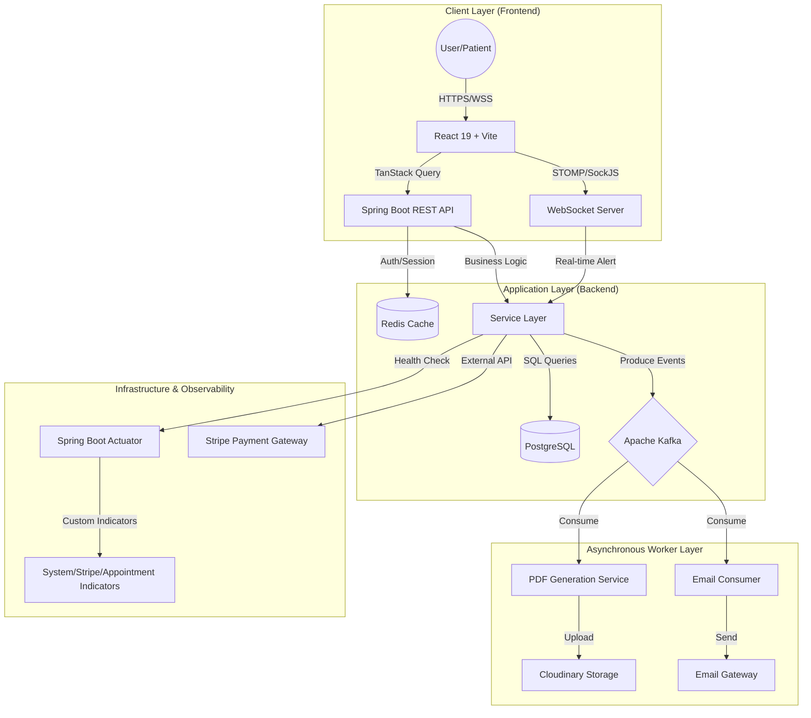

# 🏥 HMS: Enterprise Hospital Management System

[](https://www.oracle.com/java/)
[](https://spring.io/projects/spring-boot)
[](https://react.dev/)
[](https://www.postgresql.org/)
[](https://redis.io/)
[](https://kafka.apache.org/)

**HMS** is a production-ready, distributed healthcare ecosystem designed to digitize high-traffic hospital operations. It implements a **Decoupled Event-Driven Architecture**, ensuring that critical patient-facing services remain responsive while heavy computational tasks are handled asynchronously.

---

## 🗺️ High-Level Design (HLD) - Deep Dive

The system is designed to handle high concurrency and provide real-time updates using a multi-layered communication strategy.

### 📐 System Architecture Diagram


### ⚙️ Core Architectural Pillars

#### 1. Event-Driven Asynchronicity (The Kafka Engine)
To prevent the "Request-Response Lag," the system offloads heavy tasks to **Apache Kafka**. 
- **Scenario: Appointment Completion** $\rightarrow$ Instead of making the doctor wait while a PDF is generated and an email is sent, the system publishes an `AppointmentKafkaEvent`.
- **Worker Flow**: 
    1. `EmailKafkaConsumer` picks up the event.
    2. `PrescriptionPdfService` generates a branded medical PDF using **OpenPDF**.
    3. The PDF is streamed to **Cloudinary** for secure hosting.
    4. A final email is dispatched with a secure, signed URL to the patient.

#### 2. Real-time State Synchronization (WebSockets)
The "Receptionist $\rightarrow$ Doctor" routing is handled via a **Push-based model** rather than polling.
- When a receptionist routes a patient, a message is pushed to a specific Kafka topic $\rightarrow$ processed by `ReceptionistQueueNotificationListener` $\rightarrow$ dispatched via **WebSockets** to the Doctor's specific session.

#### 3. Advanced Observability & Health Monitoring
Unlike basic apps, HMS implements **Custom Health Indicators** via Spring Boot Actuator to monitor business-critical dependencies:
- `StripeHealthIndicator`: Checks if the payment gateway is reachable.
- `AppointmentHealthIndicator`: Monitors the health of the appointment scheduling engine.
- `SystemHealthIndicator`: Tracks JVM memory, disk space, and database connection pool health.
- **Outcome**: SREs can monitor the `/actuator/health` endpoint to detect failures *before* users do.

#### 4. Performance Optimization (Caching & Rate Limiting)
- **Distributed Caching**: **Redis** is used to cache Doctor profiles and Branch metadata, reducing PostgreSQL read latency for the most visited pages.
- **Traffic Shaping**: **Resilience4j** implements Rate Limiting on sensitive endpoints (Payment/Login) to prevent brute-force attacks and API exhaustion.

---

## 🛠️ Low-Level Design (LLD)

### 🖥️ Frontend Engineering (React 19)
The frontend is structured as a **Feature-Sliced Design** to maximize scalability.

- **State Strategy**: 
    - **Server State**: `TanStack Query` handles caching, deduplication, and background refetching of medical records.
    - **Real-time State**: `StompJS` manages a persistent connection to the backend for instant alerts.
- **UI/UX**: 
    - **GSAP & Three.js**: Used for an enterprise-grade, immersive landing page and smooth dashboard transitions.
    - **Tailwind CSS 4**: Utilizes a strict design system for consistent spacing and typography across the Patient and Admin portals.

### ⚙️ Backend Engineering (Java 21)
Following the **Clean Architecture** principles:

- **Controller Layer**: Validates input via `@Valid` and maps Entities to **DTOs (Data Transfer Objects)** to prevent leaking internal database structures.
- **Service Layer**: Implements business rules. Uses `@Transactional` to ensure that if a payment succeeds but an appointment fails, the system rolls back (Atomic transactions).
- **Persistence Layer**: **Spring Data JPA** with **Flyway** migrations. Every DB change is versioned (`V1__...`, `V2__...`), ensuring consistency across Dev, Staging, and Production environments.
- **Security**: Stateless **JWT (JSON Web Tokens)** with Role-Based Access Control (RBAC). Custom filters intercept every request to verify the user's role (Patient/Doctor/Admin).

---

## 💾 Data Architecture

The database is designed for **High Integrity (ACID)** using a 3rd Normal Form (3NF) approach.

### 🗝️ Entity Relationship Summary
- **Users $\leftrightarrow$ Patients/Doctors**: One-to-One (User handles Auth, Patient/Doctor handles Profile).
- **Branch $\leftrightarrow$ Doctors**: One-to-Many (A branch has many doctors).
- **Appointment $\leftrightarrow$ Patient/Doctor/Branch**: Many-to-One (The central junction table).
- **Appointment $\leftrightarrow$ Prescription**: One-to-One (Each completed appointment generates one prescription).
- **Appointment $\leftrightarrow$ Payment**: One-to-One (Each appointment is linked to one financial transaction).

---

## 🔄 Deep-Dive Workflow Analysis

### 1. The "Smart Booking" Pipeline
`Patient` $\rightarrow$ `Doctor Selection` $\rightarrow$ `Slot Validation` $\rightarrow$ `Stripe Payment` $\rightarrow$ `DB Persistence` $\rightarrow$ `Kafka Event` $\rightarrow$ `Email Confirmation`.
- **Edge Case Handling**: Uses **Optimistic Locking** to ensure that if two patients try to book the same slot at the same millisecond, only one succeeds.

### 2. The "Patient Routing" Pipeline
`Patient Arrival` $\rightarrow$ `Receptionist Check-in` $\rightarrow$ `WebSocket Push` $\rightarrow$ `Doctor Alert` $\rightarrow$ `Consultation Start`.
- **Low Latency**: Bypasses the database for the notification, sending a direct message from the Receptionist's session to the Doctor's session.

### 3. The "Digital Prescription" Pipeline
`Consultation End` $\rightarrow$ `Prescription Data Entry` $\rightarrow$ `PDF Engine (OpenPDF)` $\rightarrow$ `Cloudinary Upload` $\rightarrow$ `Kafka Event` $\rightarrow$ `Email Delivery`.
- **Durability**: The PDF is stored in the cloud (Cloudinary) rather than the DB to keep the database lean and improve load times.

---

## 🚀 Engineering Highlights for Recruiters

- **Complexity**: Handled Distributed Systems challenges (Eventual Consistency via Kafka).
- **Modern Stack**: Leveraged the latest features of **Java 21 (Virtual Threads/Records)** and **React 19**.
- **Observability**: Implemented custom Actuator health checks for proactive monitoring.
- **Security**: Integrated OAuth2 and JWT for secure, scalable authentication.
- **UX/UI**: Combined 3D elements (Three.js) with high-performance state management (React Query).

---

## 🖼️ Visual Gallery

### 🖥️ Dashboards
| Role | Screenshot | Feature Highlight |
| :--- | :--- | :--- |
| **Patient** | `` | Smart Slot Booking & Digital Health Records |
| **Doctor** | `` | Real-time Patient Queue & PDF Prescriptions |
| **Receptionist** | `` | One-click Doctor Routing & Patient Intake |
| **Admin** | `` | Branch Resource Management & Audit Logs |
| **HeadAdmin** | `` | Global Revenue Analytics & System Health |

### 🎥 Technical Demos
- [Full System Walkthrough](#) | [Kafka Async Flow Demo](#) | [Real-time Routing Demo](#)

---

## 🛠️ Setup & Installation

### Backend
```bash
cd Backend
# Configure .env with DB_URL, KAFKA_BOOTSTRAP, CLOUDINARY_URL, STRIPE_KEY
./mvnw spring-boot:run
```
**API Specs**: `http://localhost:8080/swagger-ui/index.html` | **Health**: `http://localhost:8080/actuator/health`

### Frontend
```bash
cd Frontend
npm install
npm run dev
```

---
**Developed by [OM PRAKASH]** | [LinkedIn](Not Persent) | [Portfolio](www.omprakashjavadev.in) | [Email](op2624685@gmail.com)
